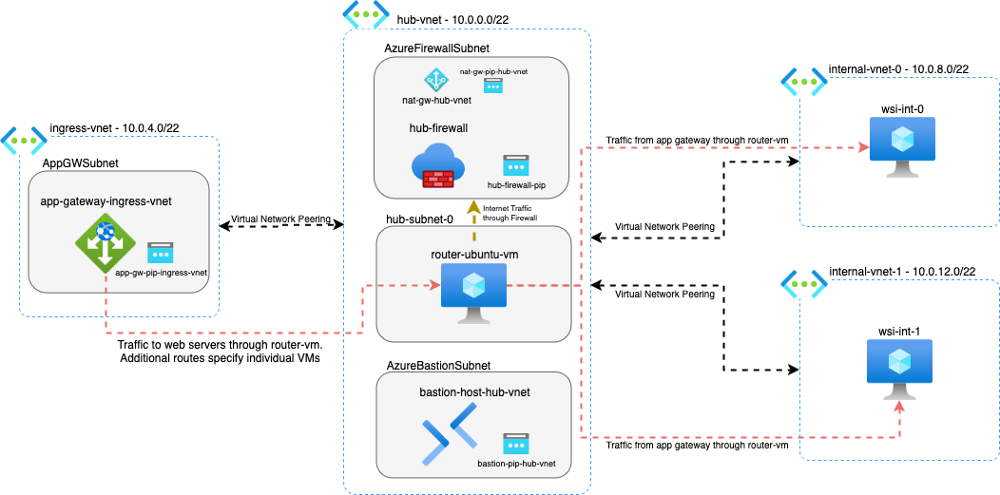

# Terraform Hub & Spoke Network

Deploying a simple Hub & Spoke network with a VM as a router.

## Example Variables File

The below `.tfvars` will deploy four VNets:

- A hub VNet `hub-vnet` using address space `10.0.0.0/22` with three subnets. One AzureBastionSubnet is used for a central bastion host that can connect to VMs in peered VNets. One AzureFirewallSubnet has an attached NAT Gateway and is used for all outbound traffic through a Standard Azure Firewall. And one regular subnet is used to house a Windows VM configured for transitive routing. This will be the hub of the hub and spoke network.
  - Traffic from the Spoke VNets gets sent to the router VM, which will direct all outbound internet traffic to the Firewall's private IP to allow/block traffic out to the internet, sending approved traffic out through the NAT Gateway.
  - Any internal traffic will be routed to the appropriate VNets without passing through the Firewall or NAT Gateway.
- An ingress VNet `ingress-vnet` using address space `10.0.4.0/22` with two private subnets and a dedicated subnet for an Application Gateway. This will house the Application Gateway which will point to web servers deployed in `internal-vnet-0` and `internal-vnet-1`. This is peered to and from `hub-vnet`.
- An internal VNet `internal-vnet-0` using address space `10.0.8.0/22` with two regular subnets. This will house a single web server. This is peered to and from `hub-vnet`.
- An internal VNet `internal-vnet-1` using address space `10.0.12.0/22` with two regular subnets. This will house a single web server. This is peered to and from `hub-vnet`.

The non-hub VNets all have routes which will route their local traffic within themselves, and all other traffic towards `supernet_cidr_range` (`10.0.0.0/8`) will be routed towards the router VM in `hub-vnet`. All other internet traffic will also be routed to the router VM in `hub-vnet` to be routed out through the Firewall and NAT Gateway.

The router VM will route traffic transitively into the relevant peered VNets, allowing for the app gateway in the ingress VNet to direct traffic towards the web servers in two separate internal VNets.

A diagram of this configuration is as below:



```
resource_group_name = "Sandbox_RG"

enable_router_vm           = true
enable_central_bastion     = true
enable_central_firewall    = true
enable_central_nat_gateway = true
router_password            = "MyS@fePassw0rd"

hub_cidr_range      = "10.0.0.0/22"
supernet_cidr_range = "10.0.0.0/8"

internal_vnets_config = {

  "ingress-vnet" = {
    cidr_range         = "10.0.4.0/22"
    num_subnets        = 3
    deploy_wsi         = false
    enable_bastion     = false
    enable_nat_gateway = false

    app_gw_config = {
      deploy_app_gw = true
      target_vnets  = ["internal-vnet-0", "internal-vnet-1"]
    }
  }

  "internal-vnet-0" = {
    cidr_range     = "10.0.8.0/22"
    num_subnets    = 2
    deploy_wsi     = true
    enable_bastion = false
  }

  "internal-vnet-1" = {
    cidr_range  = "10.0.12.0/22"
    num_subnets = 2
    deploy_wsi  = true
  }
}
```

<!-- BEGINNING OF PRE-COMMIT-OPENTOFU DOCS HOOK -->
## Requirements

| Name | Version |
|------|---------|
| <a name="requirement_terraform"></a> [terraform](#requirement\_terraform) | ~> 1.0 |
| <a name="requirement_azurerm"></a> [azurerm](#requirement\_azurerm) | ~> 3.0 |
| <a name="requirement_random"></a> [random](#requirement\_random) | ~> 3.0 |
| <a name="requirement_tls"></a> [tls](#requirement\_tls) | ~> 4.0 |

## Providers

| Name | Version |
|------|---------|
| <a name="provider_azurerm"></a> [azurerm](#provider\_azurerm) | ~> 3.0 |
| <a name="provider_random"></a> [random](#provider\_random) | ~> 3.0 |
| <a name="provider_tls"></a> [tls](#provider\_tls) | ~> 4.0 |

## Modules

| Name | Source | Version |
|------|--------|---------|
| <a name="module_hub_vnet"></a> [hub\_vnet](#module\_hub\_vnet) | Azure/vnet/azurerm | ~> 4.0 |
| <a name="module_spoke_vnet"></a> [spoke\_vnet](#module\_spoke\_vnet) | Azure/vnet/azurerm | ~> 4.0 |

## Resources

| Name | Type |
|------|------|
| [azurerm_application_gateway.application_gateway](https://registry.terraform.io/providers/hashicorp/azurerm/latest/docs/resources/application_gateway) | resource |
| [azurerm_bastion_host.bastion_host](https://registry.terraform.io/providers/hashicorp/azurerm/latest/docs/resources/bastion_host) | resource |
| [azurerm_firewall.firewall](https://registry.terraform.io/providers/hashicorp/azurerm/latest/docs/resources/firewall) | resource |
| [azurerm_firewall_policy.firewall_policy](https://registry.terraform.io/providers/hashicorp/azurerm/latest/docs/resources/firewall_policy) | resource |
| [azurerm_firewall_policy_rule_collection_group.firewall_policy_rule_collection](https://registry.terraform.io/providers/hashicorp/azurerm/latest/docs/resources/firewall_policy_rule_collection_group) | resource |
| [azurerm_key_vault.vm_key_vault](https://registry.terraform.io/providers/hashicorp/azurerm/latest/docs/resources/key_vault) | resource |
| [azurerm_key_vault_secret.linux_ssh_private_key](https://registry.terraform.io/providers/hashicorp/azurerm/latest/docs/resources/key_vault_secret) | resource |
| [azurerm_key_vault_secret.webserver_password](https://registry.terraform.io/providers/hashicorp/azurerm/latest/docs/resources/key_vault_secret) | resource |
| [azurerm_linux_virtual_machine.router_ubuntu_vm](https://registry.terraform.io/providers/hashicorp/azurerm/latest/docs/resources/linux_virtual_machine) | resource |
| [azurerm_nat_gateway.nat_gw](https://registry.terraform.io/providers/hashicorp/azurerm/latest/docs/resources/nat_gateway) | resource |
| [azurerm_nat_gateway_public_ip_association.nat_gw_pip_association](https://registry.terraform.io/providers/hashicorp/azurerm/latest/docs/resources/nat_gateway_public_ip_association) | resource |
| [azurerm_network_interface.router_ubuntu_nic_private](https://registry.terraform.io/providers/hashicorp/azurerm/latest/docs/resources/network_interface) | resource |
| [azurerm_network_interface.webserver_nic](https://registry.terraform.io/providers/hashicorp/azurerm/latest/docs/resources/network_interface) | resource |
| [azurerm_network_interface_security_group_association.router_ubuntu_private_nsg_assoc](https://registry.terraform.io/providers/hashicorp/azurerm/latest/docs/resources/network_interface_security_group_association) | resource |
| [azurerm_network_interface_security_group_association.webserver_nsg_assoc](https://registry.terraform.io/providers/hashicorp/azurerm/latest/docs/resources/network_interface_security_group_association) | resource |
| [azurerm_network_security_group.router_ubuntu_nsg](https://registry.terraform.io/providers/hashicorp/azurerm/latest/docs/resources/network_security_group) | resource |
| [azurerm_network_security_group.webserver_nsg](https://registry.terraform.io/providers/hashicorp/azurerm/latest/docs/resources/network_security_group) | resource |
| [azurerm_network_security_rule.http_router_inbound](https://registry.terraform.io/providers/hashicorp/azurerm/latest/docs/resources/network_security_rule) | resource |
| [azurerm_network_security_rule.http_router_outbound](https://registry.terraform.io/providers/hashicorp/azurerm/latest/docs/resources/network_security_rule) | resource |
| [azurerm_network_security_rule.http_windows_inbound](https://registry.terraform.io/providers/hashicorp/azurerm/latest/docs/resources/network_security_rule) | resource |
| [azurerm_network_security_rule.http_windows_outbound](https://registry.terraform.io/providers/hashicorp/azurerm/latest/docs/resources/network_security_rule) | resource |
| [azurerm_public_ip.app_gateway_pip](https://registry.terraform.io/providers/hashicorp/azurerm/latest/docs/resources/public_ip) | resource |
| [azurerm_public_ip.bastion_pip](https://registry.terraform.io/providers/hashicorp/azurerm/latest/docs/resources/public_ip) | resource |
| [azurerm_public_ip.firewall_pip](https://registry.terraform.io/providers/hashicorp/azurerm/latest/docs/resources/public_ip) | resource |
| [azurerm_public_ip.nat_gw_pip](https://registry.terraform.io/providers/hashicorp/azurerm/latest/docs/resources/public_ip) | resource |
| [azurerm_route.router_to_firewall](https://registry.terraform.io/providers/hashicorp/azurerm/latest/docs/resources/route) | resource |
| [azurerm_route.spoke_to_hub](https://registry.terraform.io/providers/hashicorp/azurerm/latest/docs/resources/route) | resource |
| [azurerm_route.spoke_to_local](https://registry.terraform.io/providers/hashicorp/azurerm/latest/docs/resources/route) | resource |
| [azurerm_route.spoke_to_natgw](https://registry.terraform.io/providers/hashicorp/azurerm/latest/docs/resources/route) | resource |
| [azurerm_route_table.hub_rtb](https://registry.terraform.io/providers/hashicorp/azurerm/latest/docs/resources/route_table) | resource |
| [azurerm_route_table.spoke_to_hub](https://registry.terraform.io/providers/hashicorp/azurerm/latest/docs/resources/route_table) | resource |
| [azurerm_ssh_public_key.linux_ssh_public_key](https://registry.terraform.io/providers/hashicorp/azurerm/latest/docs/resources/ssh_public_key) | resource |
| [azurerm_subnet_nat_gateway_association.nat_gw_subnet_association](https://registry.terraform.io/providers/hashicorp/azurerm/latest/docs/resources/subnet_nat_gateway_association) | resource |
| [azurerm_subnet_route_table_association.hub_rtb_assoc](https://registry.terraform.io/providers/hashicorp/azurerm/latest/docs/resources/subnet_route_table_association) | resource |
| [azurerm_subnet_route_table_association.spoke_rtb_assoc](https://registry.terraform.io/providers/hashicorp/azurerm/latest/docs/resources/subnet_route_table_association) | resource |
| [azurerm_virtual_machine_extension.web_server_install](https://registry.terraform.io/providers/hashicorp/azurerm/latest/docs/resources/virtual_machine_extension) | resource |
| [azurerm_virtual_network_peering.hub_to_spoke](https://registry.terraform.io/providers/hashicorp/azurerm/latest/docs/resources/virtual_network_peering) | resource |
| [azurerm_virtual_network_peering.spoke_to_hub](https://registry.terraform.io/providers/hashicorp/azurerm/latest/docs/resources/virtual_network_peering) | resource |
| [azurerm_windows_virtual_machine.webserver_vm](https://registry.terraform.io/providers/hashicorp/azurerm/latest/docs/resources/windows_virtual_machine) | resource |
| [random_string.key_vault_random_string](https://registry.terraform.io/providers/hashicorp/random/latest/docs/resources/string) | resource |
| [tls_private_key.linux_ssh_key](https://registry.terraform.io/providers/hashicorp/tls/latest/docs/resources/private_key) | resource |
| [azurerm_client_config.current](https://registry.terraform.io/providers/hashicorp/azurerm/latest/docs/data-sources/client_config) | data source |
| [azurerm_resource_group.resource_group](https://registry.terraform.io/providers/hashicorp/azurerm/latest/docs/data-sources/resource_group) | data source |

## Inputs

| Name | Description | Type | Default | Required |
|------|-------------|------|---------|:--------:|
| <a name="input_enable_central_bastion"></a> [enable\_central\_bastion](#input\_enable\_central\_bastion) | A boolean to determine whether to enable a Bastion host in the hub virtual network.<br>  This Bastion will be able to connect to VMs in any spoke VNet. | `bool` | `false` | no |
| <a name="input_enable_central_firewall"></a> [enable\_central\_firewall](#input\_enable\_central\_firewall) | A boolean to determine whether to create an Azure Firewall in the hub virtual network. | `bool` | `false` | no |
| <a name="input_enable_central_nat_gateway"></a> [enable\_central\_nat\_gateway](#input\_enable\_central\_nat\_gateway) | A boolean to determine whether to create a NAT Gateway in the hub virtual network.<br>  This will be used by all spoke VNets without dedicated NAT Gateways. | `bool` | `false` | no |
| <a name="input_enable_router_vm"></a> [enable\_router\_vm](#input\_enable\_router\_vm) | A boolean to determine whether to enable the Router VM in the Hub VNet. | `bool` | `false` | no |
| <a name="input_hub_cidr_range"></a> [hub\_cidr\_range](#input\_hub\_cidr\_range) | The CIDR range to provision for the Hub VNet | `string` | `"10.0.0.0/22"` | no |
| <a name="input_internal_vnets_config"></a> [internal\_vnets\_config](#input\_internal\_vnets\_config) | A map of configuration for internal VNets to deploy and connect to the hub. | <pre>map(object({<br>    cidr_range        = string<br>    num_subnets       = number<br>    deploy_wsi        = optional(bool, false)<br>    enable_bastion    = optional(bool, false)<br>    enable_nat_gw     = optional(bool, false)<br>    service_endpoints = optional(list(string), [])<br>    subnet_delegation = optional(map(map(object({<br>      service_name    = string<br>      service_actions = list(string)<br>    }))), {})<br><br>    app_gw_config = optional(object({<br>      deploy_app_gw = optional(bool, false)<br>      target_vnets  = optional(list(string), [])<br>    }), {})<br>  }))</pre> | n/a | yes |
| <a name="input_resource_group_name"></a> [resource\_group\_name](#input\_resource\_group\_name) | The name of the resource group to deploy to. | `string` | n/a | yes |
| <a name="input_router_password"></a> [router\_password](#input\_router\_password) | The password for the Router VM. May be stored as plain text in the state. | `string` | `null` | no |
| <a name="input_supernet_cidr_range"></a> [supernet\_cidr\_range](#input\_supernet\_cidr\_range) | The \"supernet\" cidr range that will be used to define routes through the hub.<br>  This should cover all of your VNet address spaces. Defaults to 10.0.0.0/8. | `string` | `"10.0.0.0/8"` | no |

## Outputs

No outputs.
<!-- END OF PRE-COMMIT-OPENTOFU DOCS HOOK -->
